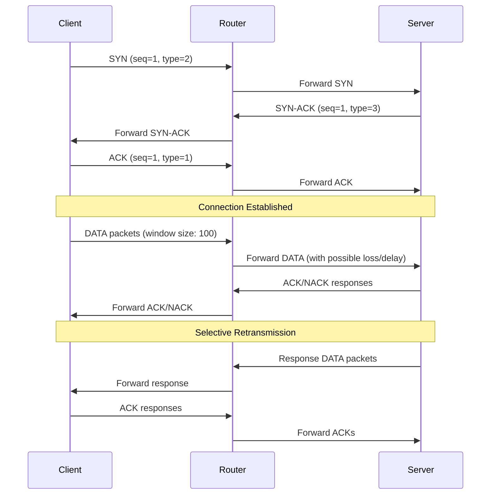

## System Architecture

The Selective Repeat UDP project implements a reliable data transfer protocol over UDP using the Selective Repeat ARQ (Automatic Repeat reQuest) mechanism. The system consists of three main components that work together to provide reliable communication over an unreliable network layer.

## Three-Component Architecture

<CardGroup cols={3}>
  <Card title="Client" icon="laptop">
    Initiates connections and sends HTTP-style requests using the reliable protocol
  </Card>
  <Card title="Server" icon="server">
    Handles multiple client connections and processes HTTP GET/POST requests
  </Card>
  <Card title="Router" icon="network-wired">
    Simulates network conditions with configurable packet loss and delays
  </Card>
</CardGroup>

### Client Component

The client is implemented in Java and consists of two main classes:

- **`Httpc`** (`client/Httpc.java`) - HTTP client interface that parses commands and formats HTTP requests
- **`ReliableClientProtocol`** (`client/ReliableClientProtocol.java`) - Implements the Selective Repeat protocol for reliable data transfer

**Key Responsibilities:**
- Establish three-way handshake connections with the server
- Fragment large data into 1013-byte payload chunks
- Maintain a sliding window for transmission (default window size: 100 packets)
- Handle ACK/NACK responses and retransmit lost packets
- Implement timeout-based retransmission with exponential backoff

**Connection Flow:**
```java
// Client initiates connection on port 8000
DatagramSocket socket = new DatagramSocket();
InetSocketAddress serverAddress = new InetSocketAddress("server-ip", 8000);
int port = ReliableClientProtocol.connection(socket, serverAddress);
```

<Info>
The client always communicates through the router at `127.0.0.1:3000`, which forwards packets to the actual destination.
</Info>

### Server Component

The server is implemented in Java with a multi-threaded architecture:

- **`ServerTcpProtocl`** (`Server/ServerTcpProtocl.java`) - Main server class handling connection handshakes
- **`clientHandler`** - Inner class that processes individual client requests in separate threads
- **`HttpcLib`** (`Server/HttpcLib.java`) - HTTP request processor for GET and POST operations

**Key Responsibilities:**
- Listen for connection requests on the main port (default: 8000)
- Create dedicated handler sockets for each unique client
- Implement Selective Repeat protocol for receiving data
- Process HTTP GET/POST requests and serve files from a directory
- Send responses using the same reliable protocol

**Multi-Client Handling:**
```java
// Server maintains a mapping of client addresses to handler sockets
private static HashMap<InetAddress, DatagramSocket> socketMapping;

// Each client gets a dedicated handler thread
new Thread(new clientHandler(datasocket, clientAddress)).start();
```

<Warning>
The server creates a new `DatagramSocket` for each client to handle concurrent connections. Each handler communicates on a unique port returned to the client during the handshake.
</Warning>

### Router Component

The router is implemented in Go and simulates real-world network conditions:

- **`router.go`** (`Router/source/router.go`) - Network simulator with configurable parameters

**Key Responsibilities:**
- Receive packets from both clients and servers on port 3000
- Parse packet headers to determine destination
- Simulate packet loss based on configurable drop rate
- Introduce random delays (0 to max-delay) to simulate network latency
- Forward packets to their intended destinations
- Swap peer addresses during routing

**Configuration Parameters:**
```bash
router --port=3000 --drop-rate=0.2 --max-delay=10ms --seed=1
```

<Note>
**Router Parameters:**
- `--port`: Listening port (default: 3000)
- `--drop-rate`: Probability of packet loss (0.0 to 1.0)
- `--max-delay`: Maximum delay for packet delivery (e.g., 10ms, 100ms)
- `--seed`: Random seed for reproducible testing
</Note>

## Communication Flow



## Key Design Features

### 1. Sliding Window Protocol

Both client and server maintain a sliding window with:
- **Window Size**: 100 packets (configurable)
- **Last ACK Received**: Tracks the highest cumulative ACK
- **Packet Buffer**: Stores unacknowledged packets for retransmission

### 2. Packet Fragmentation

Large data is split into chunks:
- **Payload Size**: 1013 bytes per packet
- **Header Size**: 11 bytes (type + sequence + address + port)
- **Total Packet Size**: Maximum 1024 bytes

### 3. Timeout and Retransmission

Each packet has an associated timer:
- **Initial Timeout**: 30ms (client) / 30ms (server)
- **Maximum Retries**: 10 attempts
- **Timer Implementation**: Separate thread per packet using `Timer` class

### 4. Thread-Based Concurrency

**Client:**
- Main thread handles sending initial window
- Timer threads for each packet timeout
- Receive thread processes ACK/NACK responses

**Server:**
- Main thread accepts connections
- Handler thread per client
- Timer threads for packet retransmission

**Router:**
- Single goroutine-based event loop
- Time-delayed packet delivery using `time.AfterFunc`

## Technology Stack

<CardGroup cols={3}>
  <Card title="Client" icon="java">
    **Java**
    - JDK 8+
    - DatagramSocket API
    - Multi-threading
  </Card>
  <Card title="Server" icon="java">
    **Java**
    - JDK 8+
    - HashMap for client tracking
    - File I/O operations
  </Card>
  <Card title="Router" icon="golang">
    **Go**
    - net package
    - Goroutines
    - Atomic operations
  </Card>
</CardGroup>

## Source Code Structure

```
source/
├── Client/
│   └── src/main/java/
│       ├── client/
│       │   ├── Httpc.java              # HTTP client interface
│       │   ├── ReliableClientProtocol.java  # SR protocol
│       │   └── CLient.java
│       └── util/
│           ├── Packet.java             # Packet structure
│           ├── Timer.java              # Timeout handler
│           └── TimeoutBlock.java       # Timeout utility
├── Server/
│   └── src/main/java/
│       ├── Server/
│       │   ├── ServerTcpProtocl.java   # Main server + SR protocol
│       │   ├── HttpcLib.java           # HTTP processor
│       │   └── ServerCommand.java
│       └── Util/
│           ├── Packet.java
│           ├── Timer.java
│           └── TimeoutBlock.java
└── Router/
    └── source/
        └── router.go                   # Network simulator
```

## Performance Characteristics

<AccordionGroup>
  <Accordion title="Throughput">
    With a window size of 100 packets and 1013-byte payloads:
    - **Maximum throughput**: ~101.3 KB per window
    - **Effective throughput**: Depends on RTT and packet loss rate
    - Formula: `Throughput ≈ (WindowSize × PacketSize) / RTT`
  </Accordion>
  
  <Accordion title="Latency">
    - **Minimum RTT**: 2 × network delay (client → router → server → router → client)
    - **Timeout overhead**: 30ms per retransmission
    - **Connection setup**: 1.5 RTT (three-way handshake)
  </Accordion>
  
  <Accordion title="Reliability">
    - **Guaranteed delivery**: Up to 10 retransmission attempts
    - **In-order delivery**: Receiver buffers out-of-order packets
    - **Flow control**: Sliding window prevents receiver overflow
  </Accordion>
</AccordionGroup>

## Next Steps

<CardGroup cols={2}>
  <Card title="Selective Repeat Protocol" icon="arrows-rotate" href="/architecture/selective-repeat">
    Learn about the detailed implementation of the SR-ARQ protocol
  </Card>
  <Card title="Packet Structure" icon="box" href="/architecture/packet-structure">
    Understand the packet format and header fields
  </Card>
</CardGroup>