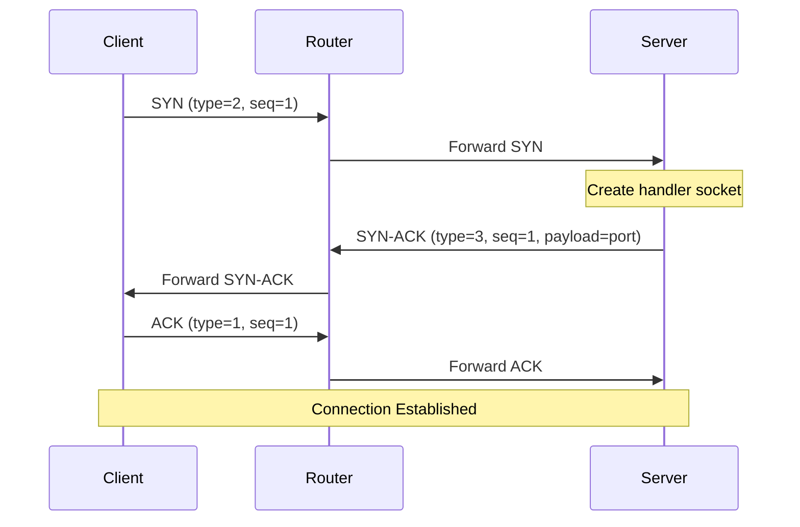

## Overview

The Selective Repeat ARQ (Automatic Repeat reQuest) protocol is a sliding window protocol that provides reliable data transfer over an unreliable network. Unlike Go-Back-N, Selective Repeat individually acknowledges and retransmits only the packets that are lost or corrupted, making it more efficient in networks with high error rates.

<Info>
This implementation uses **both ACK and NACK** mechanisms: ACKs acknowledge successfully received packets, while NACKs explicitly request retransmission of missing packets.
</Info>

## Protocol State Machine

### Sender State Machine

The sender maintains three key state variables:

```java
static int lastack = 0;        // Last cumulative ACK received
static int window = 100;        // Current window upper bound
static List<DatagramPacket> packets = new ArrayList<>();  // Buffer for unACKed packets
```

**State Transitions:**

<Steps>
  <Step title="Initialization">
    - Set `lastack = 0` (no packets acknowledged)
    - Set `window = 100` (initial window size)
    - Prepare packet buffer with all data packets
  </Step>
  
  <Step title="Send Initial Window">
    - Send first `min(totalPackets, windowSize)` packets
    - Start timeout timer for each sent packet
    - Transition to "Waiting for ACKs" state
  </Step>
  
  <Step title="Process ACK/NACK">
    - On **ACK**: Slide window forward, send new packets
    - On **NACK**: Retransmit specific packet immediately
    - On **Timeout**: Retransmit packet after timeout period
  </Step>
  
  <Step title="Completion">
    - When `lastack >= totalPackets`, all packets acknowledged
    - Close connection or await response
  </Step>
</Steps>

### Receiver State Machine

The receiver maintains:

```java
int expseqNum = 2;              // Expected sequence number
int maxWindow = 100;             // Maximum acceptable sequence number
HashMap<Integer, byte[]> data = new HashMap<>();  // Buffer for out-of-order packets
```

**Processing Logic:**

<CodeGroup>
```java Packet within window (pSeq ≤ maxWindow)
if (pSeq == expseqNum) {
    // Expected packet received
    data.put(expseqNum, p.getPayload());
    
    // Check for consecutive packets in buffer
    for (i = expseqNum; i <= totalPackets; i++) {
        if (data.containsKey(i)) {
            expseqNum++;  // Slide window
            maxWindow++;
        } else {
            // Send cumulative ACK for (i-1)
            sendAck(i - 1);
            break;
        }
    }
}
```

```java Out-of-order packet (pSeq > expseqNum)
if (pSeq > expseqNum) {
    // Buffer the packet
    data.put(pSeq, p.getPayload());
    
    // Send NACKs for all missing packets
    for (i = expseqNum; i < pSeq; i++) {
        if (!data.containsKey(i)) {
            sendNack(i);  // Request missing packet
        }
    }
}
```

```java Duplicate packet (pSeq < expseqNum)
if (pSeq < expseqNum) {
    // Already received, send ACK again
    sendAck(pSeq);
}
```
</CodeGroup>

## Sliding Window Mechanism

### Window Movement

The sliding window advances based on cumulative acknowledgments:

```
Initial State (window = 100, lastack = 0):
┌─────────────────────────────────────────────────────────┐
│ Packets 1-100 (in window, can be sent)                  │
└─────────────────────────────────────────────────────────┘
│ Packets 101+ (outside window, cannot send yet)          │
└─────────────────────────────────────────────────────────┘

After receiving ACK for packet 50 (lastack = 50, window = 150):
                    ┌─────────────────────────────────────────┐
                    │ Packets 51-150 (new window)              │
                    └─────────────────────────────────────────┘
┌───────────────────┐│ Packets 151+ (outside window)           │
│ Packets 1-50 ACKed││                                          │
└───────────────────┘└─────────────────────────────────────────┘
```

<Note>
The window slides by `newacks = ackSeq - lastack + 1` positions when an ACK is received.
</Note>

### Sender Window Management

Implementation in `ReliableClientProtocol.java:187-219`:

```java
while (lastack < nofpackets + 1) {
    DatagramPacket ack = receivePacket();
    Packet ackpacket = Packet.fromBytes(ack.getData());
    
    // ACK received for packet within window
    if (ackpacket.getType() == 1 &&  // Type: ACK
        ackpacket.getSequenceNumber() > lastack && 
        ackpacket.getSequenceNumber() <= window + 1) {
        
        // Calculate how many new packets can be sent
        int newacks = (int) ackpacket.getSequenceNumber() - lastack + 1;
        
        // Send new packets to fill the window
        if (packets.size() > window) {
            for (int i = window; i < window + newacks; i++) {
                if (packets.size() > i) {
                    socket.send(packets.get(i));
                    // Start timer for new packet
                    Thread t = new Thread(new Timer(i + 2, socket, 0));
                    t.start();
                }
            }
        }
        
        // Slide the window
        window = window + newacks;
        lastack = (int) ackpacket.getSequenceNumber();
    }
}
```

<Warning>
The window only slides forward on **cumulative ACKs**, not on individual ACKs. The receiver sends cumulative ACKs for the highest in-order packet received.
</Warning>

## ACK and NACK Handling

### ACK Processing

**Cumulative Acknowledgment:**
- An ACK with sequence number `N` confirms receipt of all packets up to and including `N`
- The sender can discard packets 1 through `N` from its buffer
- The window slides forward by `N - lastack` positions

**ACK Generation (Receiver):**

```java
// Send ACK when consecutive packets are received
for (i = expseqNum; i <= totalPackets; i++) {
    if (data.containsKey(i)) {
        expseqNum++;
        maxWindow++;
    } else {
        // Send cumulative ACK for (i-1)
        Packet ack = new Packet(1, i-1, clientAddress, clientPort, new byte[0]);
        DatagramPacket ackP = new DatagramPacket(ack.toBytes(), 
                                                  ack.toBytes().length, 
                                                  routerAddress, 
                                                  routerPort);
        socket.send(ackP);
        break;
    }
}
```

### NACK Processing

**Negative Acknowledgment:**
- A NACK with sequence number `N` explicitly requests retransmission of packet `N`
- The sender immediately retransmits the requested packet
- No window adjustment occurs

**NACK Generation (Receiver):**

```java
// Packet arrived out of order
if (pSeq > expseqNum) {
    data.put(pSeq, p.getPayload());  // Buffer the packet
    
    // Send NACK for each missing packet
    for (i = expseqNum; i < pSeq; i++) {
        if (!data.containsKey(i)) {
            Packet nack = new Packet(4,      // Type: NACK
                                     i,       // Sequence of missing packet
                                     clientAddress, 
                                     clientPort, 
                                     new byte[0]);
            DatagramPacket nackP = new DatagramPacket(nack.toBytes(), 
                                                       nack.toBytes().length,
                                                       routerAddress, 
                                                       routerPort);
            socket.send(nackP);
        }
    }
}
```

**NACK Handling (Sender):**

From `ReliableClientProtocol.java:212-217`:

```java
if (ackpacket.getType() == 4 &&  // Type: NACK
    ackpacket.getSequenceNumber() > lastack && 
    ackpacket.getSequenceNumber() <= window + 1) {
    
    // Immediately retransmit the requested packet
    socket.send(packets.get((int) ackpacket.getSequenceNumber() - 2));
    
    // Restart timer for this packet
    Thread t = new Thread(new Timer((int) ackpacket.getSequenceNumber(), socket, 0));
    t.start();
}
```

<Info>
NACK provides faster recovery than waiting for timeout, significantly improving performance in lossy networks.
</Info>

## Timeout and Retransmission

### Timer Implementation

Each sent packet has an associated timer thread (`util/Timer.java:1-30`):

```java
public class Timer implements Runnable {
    int seq;            // Packet sequence number
    int retries;        // Number of retransmission attempts
    DatagramSocket socket;
    
    public Timer(int seq, DatagramSocket socket, int retries) {
        this.seq = seq;
        this.socket = socket;
        this.retries = retries;
    }
    
    @Override
    public void run() {
        try {
            Thread.sleep(30);  // Wait 30ms
            ReliableClientProtocol.isAcked(seq, socket, retries);
        } catch (InterruptedException | IOException e) {
            throw new RuntimeException(e);
        }
    }
}
```

### Timeout Handling

**Retransmission Logic:**

```java
public synchronized static void isAcked(int seq, DatagramSocket socket, int retries) 
        throws IOException {
    
    // Check if packet has been acknowledged
    if (seq <= lastack) {
        // Packet already ACKed, do nothing
        return;
    }
    
    // Check if maximum retries reached
    if (retries >= 10) {
        // Give up after 10 attempts
        return;
    }
    
    // Retransmit the packet
    socket.send(packets.get(seq - 2));
    
    // Start new timer with incremented retry counter
    Thread t = new Thread(new Timer(seq, socket, retries + 1));
    t.start();
}
```

**Timeout Progression:**

<Steps>
  <Step title="Initial Send (Retry 0)">
    Packet sent with 30ms timer started
  </Step>
  
  <Step title="First Timeout (Retry 1)">
    After 30ms, if no ACK: retransmit and start new 30ms timer
  </Step>
  
  <Step title="Subsequent Timeouts (Retry 2-9)">
    Continue retransmitting every 30ms up to 10 total attempts
  </Step>
  
  <Step title="Maximum Retries (Retry 10)">
    After 10 attempts (~300ms total), give up on packet
  </Step>
</Steps>

<Warning>
**Fixed Timeout Issue**: The implementation uses a fixed 30ms timeout without exponential backoff. In high-latency networks, this may cause premature retransmissions.
</Warning>

## Connection Establishment

### Three-Way Handshake

The protocol implements a TCP-like three-way handshake:



**Client Side** (`ReliableClientProtocol.java:22-74`):

```java
public static int connection(DatagramSocket socket, InetSocketAddress serverAddr) 
        throws IOException {
    
    // 1. Send SYN packet
    Packet syn = new Packet.Builder()
            .setType(2)              // SYN type
            .setSequenceNumber(1L)
            .setPortNumber(serverAddr.getPort())
            .setPeerAddress(serverAddr.getAddress())
            .setPayload("1".getBytes())
            .create();
    
    DatagramPacket synPacket = new DatagramPacket(
            syn.toBytes(), syn.toBytes().length, 
            routerAddr.getAddress(), routerAddr.getPort());
    socket.send(synPacket);
    
    // 2. Wait for SYN-ACK with retransmission
    socket.setSoTimeout(20);  // 20ms timeout
    while (true) {
        try {
            DatagramPacket synAckPacket = new DatagramPacket(new byte[1024], 1024);
            socket.receive(synAckPacket);
            
            Packet synAck = Packet.fromBytes(synAckPacket.getData());
            if (synAck.getType() == 3 && synAck.getSequenceNumber() == 1) {
                // SYN-ACK received
                break;
            }
        } catch (SocketTimeoutException e) {
            // Retransmit SYN
            socket.send(synPacket);
        }
    }
    
    // 3. Send ACK
    Packet ack = new Packet.Builder()
            .setType(1)              // ACK type
            .setSequenceNumber(1L)
            .setPortNumber(serverAddr.getPort())
            .setPeerAddress(serverAddr.getAddress())
            .setPayload("11".getBytes())
            .create();
    
    DatagramPacket ackPacket = new DatagramPacket(
            ack.toBytes(), ack.toBytes().length,
            routerAddr.getAddress(), routerAddr.getPort());
    socket.send(ackPacket);
    
    // Extract handler port from SYN-ACK payload
    String portStr = new String(synAck.getPayload(), StandardCharsets.UTF_8);
    return Integer.parseInt(portStr.trim());
}
```

**Server Side** (`ServerTcpProtocl.java:38-121`):

```java
public void handShake() throws IOException {
    while (true) {
        // 1. Receive SYN
        DatagramPacket request = new DatagramPacket(new byte[1024], 1024);
        connectionSocket.receive(request);
        Packet req = Packet.fromBytes(request.getData());
        
        if (req.getType() != 2) {  // Not a SYN
            continue;
        }
        
        InetAddress clientAddress = req.getPeerAddress();
        
        // Create or reuse handler socket for this client
        DatagramSocket handlerSocket;
        if (socketMapping.containsKey(clientAddress)) {
            handlerSocket = socketMapping.get(clientAddress);
        } else {
            handlerSocket = new DatagramSocket();  // Random port
            socketMapping.put(clientAddress, handlerSocket);
            
            // Start handler thread
            new Thread(new clientHandler(handlerSocket, clientAddress)).start();
        }
        
        // 2. Send SYN-ACK with handler port
        Packet synAck = new Packet(
                3,  // SYN-ACK type
                req.getSequenceNumber(),
                clientAddress,
                req.getPeerPort(),
                Integer.toString(handlerSocket.getLocalPort()).getBytes());
        
        DatagramPacket response = new DatagramPacket(
                synAck.toBytes(), synAck.toBytes().length,
                request.getAddress(), request.getPort());
        connectionSocket.send(response);
        
        // 3. Wait for ACK (with timeout)
        try {
            TimeoutBlock timeoutBlock = new TimeoutBlock(20);
            timeoutBlock.addBlock(() -> {
                while (true) {
                    DatagramPacket ackPacket = new DatagramPacket(new byte[1024], 1024);
                    connectionSocket.receive(ackPacket);
                    Packet ack = Packet.fromBytes(ackPacket.getData());
                    
                    if (ack.getType() == 1 &&  // ACK type
                        ack.getPeerAddress().equals(clientAddress)) {
                        break;  // Connection established
                    }
                }
            });
        } catch (Throwable e) {
            // Timeout waiting for ACK (client will retry SYN)
        }
    }
}
```

<Info>
**Port Allocation**: The server returns a unique handler port in the SYN-ACK payload. All subsequent data transfer uses this handler port, not the main listening port (8000).
</Info>

## Data Transfer Phase

### Sending Large Data

Both client and server use the same data transfer logic:

<Steps>
  <Step title="Fragment Data">
    Split data into 1013-byte chunks:
    ```java
    final int sizeMB = 1013;
    List<byte[]> chunks = IntStream.iterate(0, i -> i + sizeMB)
            .limit((datab.length + sizeMB - 1) / sizeMB)
            .mapToObj(i -> Arrays.copyOfRange(datab, i, Math.min(i + sizeMB, datab.length)))
            .collect(Collectors.toList());
    ```
  </Step>
  
  <Step title="Send Size Packet">
    First packet (seq=1) contains total number of packets:
    ```java
    Packet sizePacket = new Packet.Builder()
            .setType(0)  // DATA type
            .setSequenceNumber(1L)
            .setPayload(Integer.toString(nofpackets + 1).getBytes())
            .create();
    socket.send(sizePacket);
    // Wait for ACK before proceeding
    ```
  </Step>
  
  <Step title="Send Initial Window">
    Send first 100 packets (or fewer if less data):
    ```java
    int tobesent = Math.min(nofpackets, window);
    for (int i = 2; i <= tobesent + 1; i++) {
        socket.send(packets.get(i - 2));
        Thread t = new Thread(new Timer(i, socket, 0));
        t.start();
    }
    ```
  </Step>
  
  <Step title="Process ACKs/NACKs">
    Handle responses and retransmit as needed:
    - ACK → slide window, send new packets
    - NACK → retransmit specific packet
    - Timeout → retransmit after delay
  </Step>
  
  <Step title="Complete Transfer">
    Exit when `lastack >= totalPackets`
  </Step>
</Steps>

### Receiving Large Data

<Steps>
  <Step title="Receive Size Packet">
    First packet (seq=1) indicates total packets to expect:
    ```java
    Packet p = Packet.fromBytes(req.getData());
    if (p.getSequenceNumber() == 1 && p.getType() == 0) {
        String total = new String(p.getPayload());
        int totalPackets = Integer.parseInt(total.trim());
        // Send ACK
        sendAck(1);
    }
    ```
  </Step>
  
  <Step title="Receive Packets">
    Buffer packets and handle out-of-order delivery:
    ```java
    HashMap<Integer, byte[]> data = new HashMap<>();
    while (expseqNum <= totalPackets) {
        // Receive packet
        // Check if in-order, out-of-order, or duplicate
        // Send appropriate ACK/NACK
    }
    ```
  </Step>
  
  <Step title="Reassemble Data">
    Combine packets in order:
    ```java
    byte[] fullData = new byte[(totalPackets-1) * 1013];
    int k = 0;
    for (int i = 2; i <= totalPackets; i++) {
        byte[] chunk = data.get(i);
        for (int j = 0; j < chunk.length; j++) {
            fullData[k++] = chunk[j];
        }
    }
    String request = new String(fullData).trim();
    ```
  </Step>
</Steps>

## Performance Optimizations

### 1. Immediate NACK Response

<Card title="Fast Recovery" icon="bolt">
  When an out-of-order packet is received, NACKs are sent immediately for missing packets rather than waiting for timeout. This reduces retransmission delay from 30ms to ~1 RTT.
</Card>

### 2. Large Window Size

<Card title="High Throughput" icon="gauge-high">
  A window size of 100 packets allows for ~101.3 KB of outstanding data, enabling high throughput even with moderate RTT:
  - 10ms RTT → ~10 MB/s theoretical throughput
  - 50ms RTT → ~2 MB/s theoretical throughput
</Card>

### 3. Parallel Timers

<Card title="Fine-Grained Timeout" icon="clock">
  Each packet has its own timer thread, allowing individual packets to timeout and retransmit independently without affecting other packets in the window.
</Card>

## Known Limitations

<Warning>
**Limitations of Current Implementation:**

1. **Fixed Timeout**: No adaptive timeout based on RTT measurement
2. **No Congestion Control**: Window size never shrinks, only grows
3. **Limited Retry Count**: Gives up after 10 retries (~300ms)
4. **Thread Overhead**: Creating a thread per packet timer is resource-intensive
5. **No Flow Control**: Receiver cannot signal sender to slow down
</Warning>

## Comparison with Go-Back-N

| Feature | Selective Repeat | Go-Back-N |
|---------|------------------|------------|
| **Retransmission** | Only lost packets | All packets after lost one |
| **Receiver Buffer** | Required (HashMap) | Not required |
| **Efficiency** | High in lossy networks | Low in lossy networks |
| **Complexity** | Higher | Lower |
| **Window Sliding** | On cumulative ACK | On cumulative ACK |
| **Out-of-Order Delivery** | Buffered | Discarded |
| **Implementation** | This project | Not implemented |

## Testing with Different Network Conditions

Use the router to simulate various conditions:

<CodeGroup>
```bash Perfect Network
# No loss, no delay
router --port=3000 --drop-rate=0.0 --max-delay=0ms
```

```bash Moderate Loss
# 10% packet loss, 10ms average delay
router --port=3000 --drop-rate=0.1 --max-delay=20ms --seed=42
```

```bash High Loss
# 30% packet loss, 50ms average delay
router --port=3000 --drop-rate=0.3 --max-delay=100ms --seed=42
```

```bash High Latency
# No loss, 100ms average delay
router --port=3000 --drop-rate=0.0 --max-delay=200ms --seed=42
```
</CodeGroup>

<Tip>
Use the same `--seed` value for reproducible test results. This is essential for debugging specific scenarios.
</Tip>

## Source Code References

<CardGroup cols={2}>
  <Card title="Client Protocol" icon="code">
    **File**: `Client/src/main/java/client/ReliableClientProtocol.java`
    
    - Connection: Lines 22-74
    - Send Window: Lines 159-222
    - Timeout Handler: Lines 224-235
    - Receiver: Lines 264-341
  </Card>
  
  <Card title="Server Protocol" icon="code">
    **File**: `Server/src/main/java/Server/ServerTcpProtocl.java`
    
    - Handshake: Lines 38-121
    - Send Window: Lines 269-345
    - Timeout Handler: Lines 347-356
    - Receiver: Lines 361-452
  </Card>
</CardGroup>