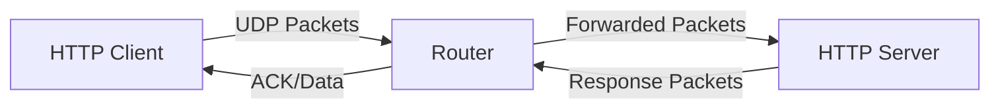

## Welcome to Selective Repeat UDP

Selective Repeat UDP is a robust implementation of HTTP over UDP that provides reliable data transfer using the Selective Repeat Automatic Repeat reQuest (ARQ) protocol. This project demonstrates how to build a reliable transport layer on top of the unreliable UDP protocol, making it suitable for applications that require guaranteed delivery without the overhead of TCP.

## What is Selective Repeat ARQ?

Selective Repeat is a sliding window protocol that allows the sender to transmit multiple packets without waiting for individual acknowledgments. Unlike Go-Back-N, Selective Repeat retransmits only those packets that are suspected to be lost or corrupted, making it more efficient in networks with higher error rates.

<CardGroup cols={2}>
  <Card
    title="HTTP Client (httpc)"
    icon="laptop-code"
    href="/quickstart#running-the-client"
  >
    A curl-like HTTP client that sends GET and POST requests over UDP with reliable delivery guarantees
  </Card>
  <Card
    title="HTTP File Server (httpfs)"
    icon="server"
    href="/quickstart#running-the-server"
  >
    A file server that handles HTTP requests over UDP, supporting file retrieval and storage operations
  </Card>
  <Card
    title="Network Router"
    icon="network-wired"
    href="/quickstart#setup-the-router"
  >
    A simulated network router written in Go that introduces realistic network conditions for testing
  </Card>
  <Card
    title="Reliable Protocol"
    icon="shield-check"
    href="#key-features"
  >
    Custom protocol implementation with windowing, acknowledgments, timeouts, and retransmission logic
  </Card>
</CardGroup>

## Key Features

### Reliable Data Transfer

The implementation ensures reliable data transfer over UDP through:

- **Selective Repeat ARQ**: Only lost packets are retransmitted, not the entire window
- **Sliding Window Protocol**: Window size of 100 packets for efficient throughput
- **Sequence Numbers**: Each packet is uniquely identified for proper ordering
- **Acknowledgments & NACKs**: Positive acknowledgments (ACK) for received packets and negative acknowledgments (NACK) for missing packets

### Three-Way Handshake

Connection establishment follows a TCP-like three-way handshake:

```java
// SYN packet (type 2)
Packet syn = new Packet.Builder()
    .setType(2)
    .setSequenceNumber(1L)
    .setPortNumber(serverAddr.getPort())
    .setPeerAddress(serverAddr.getAddress())
    .setPayload("1".getBytes())
    .create();

// SYN-ACK received (type 3)
// ACK sent (type 1)
```

### Packet Structure

Each packet contains the following fields:

<Note>
  Packets have a minimum length of 11 bytes and maximum length of 1035 bytes (11 byte header + 1024 byte payload)
</Note>

| Field | Size | Description |
|-------|------|-------------|
| Type | 1 byte | Packet type (0=Data, 1=ACK, 2=SYN, 3=SYN-ACK, 4=NACK, 6=FIN) |
| Sequence Number | 4 bytes | Packet sequence number |
| Peer Address | 4 bytes | IPv4 address |
| Peer Port | 2 bytes | Port number |
| Payload | 0-1024 bytes | Data payload |

### HTTP Over UDP Protocol

The project implements a custom HTTP variant called **HTTPFC/1.0** that works over the reliable UDP layer:

```java
// Example HTTP GET request format
GET /file.txt HTTPFC/1.0
Host: example.com
User-Agent: httpc/1.0
```

### Advanced Features

<CardGroup cols={2}>
  <Card title="Automatic Retransmission" icon="rotate">
    Packets are automatically retransmitted if acknowledgment is not received within the timeout period (50ms)
  </Card>
  <Card title="Out-of-Order Handling" icon="arrows-rotate">
    The receiver buffers out-of-order packets and sends NACKs for missing packets to trigger selective retransmission
  </Card>
  <Card title="Flow Control" icon="gauge-high">
    Sliding window mechanism prevents sender from overwhelming the receiver
  </Card>
  <Card title="Connection Management" icon="plug">
    Proper connection setup and teardown with SYN/FIN packets
  </Card>
</CardGroup>

## Architecture Overview

The system consists of three main components:

1. **Client (Java)**: Implements the HTTP client with reliable UDP protocol
2. **Server (Java)**: File server that responds to HTTP requests over UDP
3. **Router (Go)**: Simulates network conditions including packet loss, delays, and reordering



## Protocol Flow Example

Here's how a typical request-response flow works:

<Steps>
  <Step title="Connection Establishment">
    Client sends SYN packet to server, receives SYN-ACK, and sends ACK to complete handshake
  </Step>
  
  <Step title="Data Transmission Setup">
    Client sends a packet indicating the total number of packets to be sent
  </Step>
  
  <Step title="Windowed Data Transfer">
    Client sends up to 100 packets (window size) without waiting for acknowledgments
  </Step>
  
  <Step title="Selective Acknowledgment">
    Server sends ACKs for received packets and NACKs for missing packets
  </Step>
  
  <Step title="Selective Retransmission">
    Client retransmits only the packets that were NACKed or timed out
  </Step>
  
  <Step title="Window Sliding">
    As packets are acknowledged, the window slides forward allowing more packets to be sent
  </Step>
  
  <Step title="Response Reception">
    Server sends response data using the same reliable protocol
  </Step>
  
  <Step title="Connection Termination">
    Server sends FIN packet to close the connection
  </Step>
</Steps>

<Warning>
  This implementation is designed for educational purposes to demonstrate reliable transport protocols. For production use, consider standard protocols like TCP or QUIC.
</Warning>

## Use Cases

This project is ideal for:

- **Learning**: Understanding how reliable transport protocols work at a fundamental level
- **Network Research**: Experimenting with ARQ protocols and network conditions
- **Protocol Development**: Building custom protocols on top of UDP
- **Testing**: Simulating unreliable networks for application testing

## Next Steps

<CardGroup cols={2}>
  <Card
    title="Quickstart Guide"
    icon="rocket"
    href="/quickstart"
  >
    Get up and running with the client and server in minutes
  </Card>
  <Card
    title="Architecture Overview"
    icon="sitemap"
    href="/architecture/overview"
  >
    Learn about the system architecture and components
  </Card>
</CardGroup>
